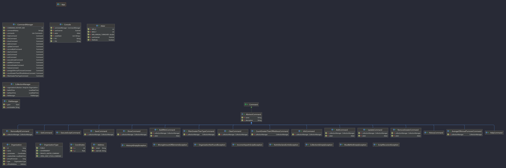

<p align="center">
  
</p>
<p align="center" style ="font-size: 24px"><em>Факультет мехатроники и робототехники</em></p>

<p align="center" style ="font-size: 24px"><strong>Лабораторная работа №5 </br>
По дисциплине : «Программирование»</br>
Вариант 751307</strong>
</p>
<p align="left">Преподаватель: <strong>Исаев Александр Сергеевич</strong></br>
Выполнил: <strong>Нгуен Тоан</strong></br>
Группа: <strong>R3137</strong>
</p>

# Лабораторная работа #5

## 1. Текст задания.
### Требования
<div id="_pbportletlab5_WAR_pbportlet_pb-lab5-text"><p>Реализовать консольное приложение, которое реализует управление коллекцией объектов в интерактивном режиме. В коллекции необходимо хранить объекты класса <code>Organization</code>, описание которого приведено ниже.</p> <p><b>Разработанная программа должна удовлетворять следующим требованиям:</b></p> <ul><li>Класс, коллекцией экземпляров которого управляет программа, должен реализовывать сортировку по умолчанию.</li><li>Все требования к полям класса (указанные в виде комментариев) должны быть выполнены.</li><li>Для хранения необходимо использовать коллекцию типа <code>java.util.ArrayList</code></li><li>При запуске приложения коллекция должна автоматически заполняться значениями из файла.</li><li>Имя файла должно передаваться программе с помощью: <b>переменная окружения</b>.</li><li>Данные должны храниться в файле в формате <code>json</code></li><li>Чтение данных из файла необходимо реализовать с помощью класса <code>java.util.Scanner</code></li><li>Запись данных в файл необходимо реализовать с помощью класса <code>java.io.FileWriter</code></li><li>Все классы в программе должны быть задокументированы в формате javadoc.</li><li>Программа должна корректно работать с неправильными данными (ошибки пользовательского ввода, отсутсвие прав доступа к файлу и т.п.).</li></ul> <p><b>В интерактивном режиме программа должна поддерживать выполнение следующих команд:</b></p> <ul><li><code>help</code> : вывести справку по доступным командам</li><li><code>info</code> : вывести в стандартный поток вывода информацию о коллекции (тип, дата инициализации, количество элементов и т.д.)</li><li><code>show</code> : вывести в стандартный поток вывода все элементы коллекции в строковом представлении</li><li><code>add {element}</code> : добавить новый элемент в коллекцию</li><li><code>update id {element}</code> : обновить значение элемента коллекции, id которого равен заданному</li><li><code>remove_by_id id</code> : удалить элемент из коллекции по его id</li><li><code>clear</code> : очистить коллекцию</li><li><code>save</code> : сохранить коллекцию в файл</li><li><code>execute_script file_name</code> : считать и исполнить скрипт из указанного файла. В скрипте содержатся команды в таком же виде, в котором их вводит пользователь в интерактивном режиме.</li><li><code>exit</code> : завершить программу (без сохранения в файл)</li><li><code>add_if_min {element}</code> : добавить новый элемент в коллекцию, если его значение меньше, чем у наименьшего элемента этой коллекции</li><li><code>remove_lower {element}</code> : удалить из коллекции все элементы, меньшие, чем заданный</li><li><code>history</code> : вывести последние 9 команд (без их аргументов)</li><li><code>average_of_annual_turnover</code> : вывести среднее значение поля annualTurnover для всех элементов коллекции</li><li><code>count_greater_than_official_address officialAddress</code> : вывести количество элементов, значение поля officialAddress которых больше заданного</li><li><code>filter_greater_than_type type</code> : вывести элементы, значение поля type которых больше заданного</li></ul> <p><b>Формат ввода команд:</b></p> <ul><li>Все аргументы команды, являющиеся стандартными типами данных (примитивные типы, классы-оболочки, String, классы для хранения дат), должны вводиться в той же строке, что и имя команды.</li><li>Все составные типы данных (объекты классов, хранящиеся в коллекции) должны вводиться по одному полю в строку.</li><li>При вводе составных типов данных пользователю должно показываться приглашение к вводу, содержащее имя поля (например, "Введите дату рождения:")</li><li>Если поле является enum'ом, то вводится имя одной из его констант (при этом список констант должен быть предварительно выведен).</li><li>При некорректном пользовательском вводе (введена строка, не являющаяся именем константы в enum'е; введена строка вместо числа; введённое число не входит в указанные границы и т.п.) должно быть показано сообщение об ошибке и предложено повторить ввод поля.</li><li>Для ввода значений null использовать пустую строку.</li><li>Поля с комментарием "Значение этого поля должно генерироваться автоматически" не должны вводиться пользователем вручную при добавлении.</li></ul> <p><b>Описание хранимых в коллекции классов: </b></p> <pre><code>public class Organization {
    private long id; //Значение поля должно быть больше 0, Значение этого поля должно быть уникальным, Значение этого поля должно генерироваться автоматически
    private String name; //Поле не может быть null, Строка не может быть пустой
    private Coordinates coordinates; //Поле не может быть null
    private java.time.LocalDateTime creationDate; //Поле не может быть null, Значение этого поля должно генерироваться автоматически
    private long annualTurnover; //Значение поля должно быть больше 0
    private OrganizationType type; //Поле может быть null
    private Address officialAddress; //Поле может быть null
}
public class Coordinates {
    private int x; //Значение поля должно быть больше -396
    private float y; //Максимальное значение поля: 969
}
public class Address {
    private String street; //Строка не может быть пустой, Поле может быть null
    private String zipCode; //Поле не может быть null
}
public enum OrganizationType {
    PUBLIC,
    GOVERNMENT,
    PRIVATE_LIMITED_COMPANY,
    OPEN_JOINT_STOCK_COMPANY;
}
</code></pre></div>

### Class diagram


## 2. Sources
**Структура папок**

Рабочая область по умолчанию содержит две папки, где:

- [`src`](https://github.com/NgToanRob/ProgrammingLab5/tree/main/src): папка для хранения исходников
- [`lib`](https://github.com/NgToanRob/ProgrammingLab5/tree/main/lib): папка для сохранения зависимостей

Между тем, скомпилированные выходные файлы будут созданы в папке [`bin`](https://github.com/NgToanRob/ProgrammingLab5/tree/main/bin) по умолчанию.

> Если вы хотите настроить структуру папок, откройте [`.vscode/settings.json`](https://github.com/NgToanRob/ProgrammingLab5/tree/main/.vscode) и обновите там соответствующие настройки.

## 3. Results
```linux
The collection has been uploaded successfully!
$ show
Organization ID: 1 (added 2022-03-15 00:25:56.282836700)
 Name: Toan's plaza
 Coordinates: X:12 Y:21.0
 Annual turnover: 100000
 Organization Type: OPEN_JOINT_STOCK_COMPANY
 Official address: Address [street=null, zipCode=nom]
$ info
Collection Information:
 Type: java.util.ArrayList
 Number of elements: 1
 Date of the last save: in this session has not yet occurred
 Date of last initialization: 2022-03-15 00:27:03.471676300 
$ help
help                                 display help on available commands
info                                 print information about the collection to standard output (type, initialization date, number of elements, etc.)
show                                 display all items in the collection
add {element}                        add a new element to the collection
update <ID> {element}                update the value of the collection element whose id is equal to the given one
remove_by_id <ID>                    remove item from collection by ID
clear                                clear the collection
save                                 save collection to file
exit                                 terminate program (without saving to file)
execute_script <file_name>           execute script from specified file
add_if_min {element}                 update the value of the collection element whose id is equal to the given one
remove_greater {element}             remove from the collection all elements greater than the specified
history                              display history of used commands
average_of_annual_turnover           read and execute the script from the specified file
count_greater_than_official_address  print the number of elements whose officialAddress field value is greater than the specified one
filter_greater_than_type  <OrganizationType>display elements whose organization type field value is equal to the given one
$
```

## 4. Conclusion

Во время выполнения данной лабораторной работы мы закрепили принципы SOLID, собственные исключения и многое другое. Также мы научились использовать Javadoc, работать с потоками, файлами, интерфейсами Comparable и Comparator. Узнали что такое сериализация и десериализация.